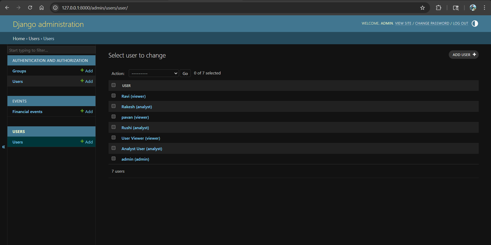
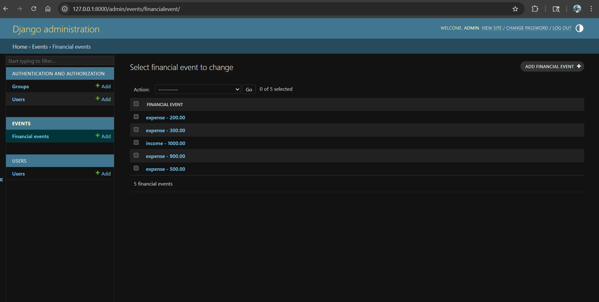
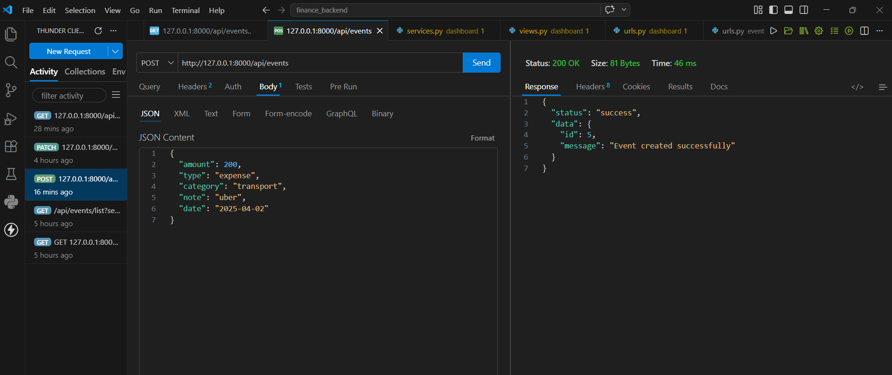
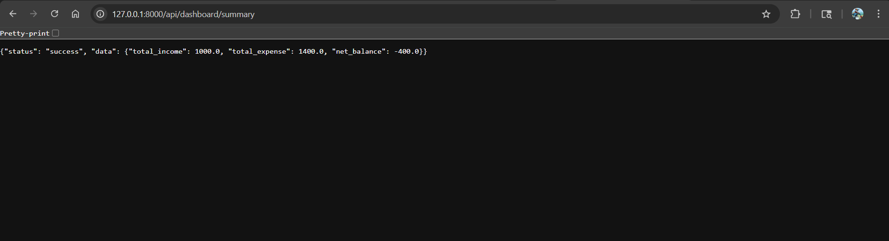
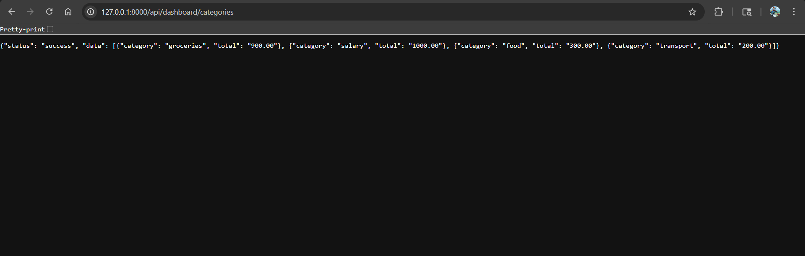

# Finance Data Processing & Access Control Backend

## Overview

I created this project as a backend system to manage financial records with role-based access control and basic dashboard insights.

Instead of focusing on building a large system, I focused on designing something that is clean, consistent, and easy to understand. The idea was to reflect how a real backend is structured, where responsibilities are clearly separated and logic is easy to follow.

---

## Live Demo

API Base url:
https://finance-backend-x4cb.onrender.com

API Docs:
https://finance-backend-x4cb.onrender.com/api/docs


## How the System Works

Every API in this project follows a simple and consistent flow:

Request → Validation → Access Control → Business Logic → Response

* The request is first received in the view
* Input is validated before processing
* Access control is checked based on user role
* Business logic is handled in the service layer
* A structured response is returned

Keeping this flow consistent helped avoid confusion and made the system predictable.

---

## Tech Stack

* Django (Backend framework)
* MySQL (Development), SQLite (deployment)
* Django ORM (Database interaction)
* Thunder Client (API testing)

---

## Features

### User and Role Management

I implemented a simple role-based system with three roles:

* Admin
* Analyst
* Viewer

Each role has different permissions:

* Admin can perform all operations
* Analyst can view and update data
* Viewer can only access dashboard data

Users also have an active or inactive status, and inactive users are restricted from all actions.

---

### Financial Records Management

I created APIs to:

* create records
* view records
* update records
* delete records (soft delete)

Each record stores:

* amount
* type (income or expense)
* category
* note
* date

I also added support for filtering and search so records can be retrieved based on:

* type
* category
* date range
* keyword (category or note)

---

### Dashboard APIs

To support a simple dashboard view, I added endpoints that return:

* total income
* total expense
* net balance
* category-wise totals

These values are calculated dynamically using aggregation queries.

---

### Access Control

Instead of handling permissions inside each API, I centralized the logic using a function:

```python
can_access(user, action)
```

This made the access rules easy to manage and avoided duplication.

---

### Validation and Error Handling

I added validation checks to ensure data is correct before saving it:

* amount must be greater than zero
* type must be valid
* required fields must be present

Errors are returned in a consistent format so they are easy to understand.

---

### Data Persistence

I used MySQL with a simple relational design.

I implemented soft delete using an `is_deleted` flag so that records are not permanently removed. This helps preserve data and avoids accidental loss.

For deployment, I used SQLite to simplify setup and avoid external database configuration. During development, MySQL was used. The core backend logic and APIs remain unchanged across both setups.

---

## API Endpoints

### Events

* POST /api/events
* GET /api/events/list
* PATCH /api/events/update/{id}
* DELETE /api/events/delete/{id}

---

### Dashboard

* GET /api/dashboard/summary
* GET /api/dashboard/categories

---

## Search and Filtering

Example:

```
/api/events/list?search=food&type=expense&from=2025-04-01&to=2025-04-30
```

This allows combining multiple filters in a single request.

---

## Data Model

### User

* id
* name
* role
* status
* created_at

---

### FinancialEvent

* id
* amount
* type
* category
* note
* date
* created_by
* created_at
* is_deleted

---

## Setup Instructions

1. Install dependencies

```
pip install django mysqlclient
```

2. Create database

```
CREATE DATABASE finance_db;
```

3. Configure database in settings.py

4. Run migrations

```
python manage.py makemigrations
python manage.py migrate
```

5. Create superuser

```
python manage.py createsuperuser
```

6. Run server

```
python manage.py runserver
```

---

## Testing

I tested the APIs using Thunder Client.

I also used Django admin to create users and verify data.

---

## Assumptions

* I used a simplified approach for authentication by selecting a user directly from the database
* Categories are stored as plain text
* Role testing is done by switching user IDs in code

---

## Trade-offs

* I chose a custom role-based system instead of Django’s built-in permissions to keep the logic simple
* Dashboard values are calculated on request instead of caching
* Soft delete is used instead of hard delete to prevent data loss

---

## Screenshots

### /api/docs


### Admin Panel (Users)



### Events List API



### Create Event API



### Dashboard Summary



### Category Summary



---

## Final Note

I focused on building a backend that is structured and reliable rather than adding unnecessary complexity. The project reflects how I approach backend development by keeping things clear, consistent, and maintainable.
